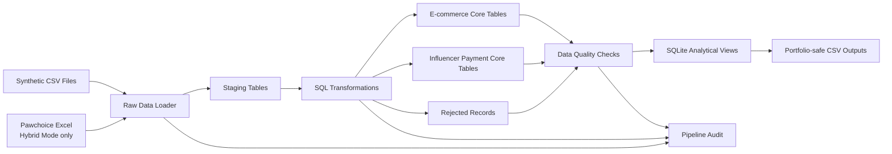
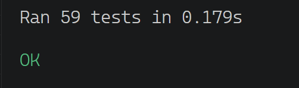
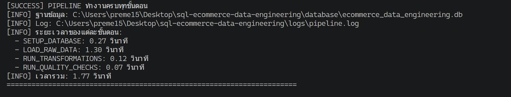
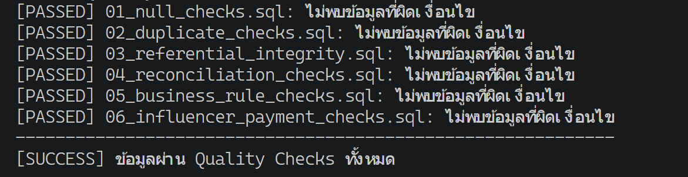

# SQL E-commerce Data Engineering

A production-style data engineering project with two execution modes: a reproducible Demo Mode using synthetic e-commerce data, and a Hybrid Mode that combines synthetic transactions with a private Pawchoice influencer payment workbook.

The pipeline ingests CSV and Excel sources, loads raw records into staging tables, applies SQL transformations, protects personally identifiable information, routes invalid records to rejected tables, validates data quality, and exports portfolio-safe analytical outputs.

---

## Project Overview

This project demonstrates an end-to-end data pipeline using:

- Python
- SQL
- SQLite
- openpyxl
- CSV and Excel ingestion
- Staging and core table architecture
- Data quality validation
- Rejected-record handling
- Data lineage
- PII hashing and masking
- Incremental and idempotent processing
- Automated tests
- Pipeline monitoring
- Portfolio-safe data exports

The project contains two data domains:

1. Synthetic e-commerce transactions
2. Pawchoice influencer payment records

The repository uses **Demo Mode by default** so anyone can clone and run the pipeline without private source files.

---

## Architecture



Detailed diagrams:

- [Pipeline Architecture](diagrams/pipeline_architecture.md)
- [Database ER Diagram](diagrams/database_er_diagram.md)

---

## Data Sources

### Synthetic e-commerce data

The project includes five synthetic CSV files:

```text
data/raw/synthetic/
├── customers.csv
├── products.csv
├── orders.csv
├── order_items.csv
└── payments.csv
```

These files demonstrate relational e-commerce entities and transactional relationships.

### Pawchoice private source data (Hybrid Mode only)

The real-world source is:

```text
data/raw/pawchoice/pawchoice_payments.xlsx
```

Expected worksheet:

```text
สรุปรอบจ่าย
```

The workbook contains multiple payment sections and repeated table headers within the same worksheet.

The actual workbook is excluded from GitHub because it may contain personal and financial information.

Demo Mode does not require this file. Hybrid Mode requires the workbook to be placed at the exact path shown above.

See:

```text
data/raw/pawchoice/README.md
```

---

## Data Privacy

The pipeline avoids storing raw sensitive information in the core database.

| Source field | Stored form |
|---|---|
| Bank account | SHA-256 hash |
| Phone number | SHA-256 hash |
| Account holder name | Partially masked |
| Notes | Sanitized |
| Source location | Lineage fields only |

Raw bank account numbers and phone numbers are not intentionally stored in the core tables.

The SQLite database, private Excel files, PDFs, and logs are excluded through `.gitignore`.

---

## Project Structure

```text
sql-ecommerce-data-engineering/
├── config/
│   └── pipeline_config.json
│
├── data/
│   ├── raw/
│   │   ├── synthetic/
│   │   └── pawchoice/
│   ├── staging/
│   └── processed/
│
├── database/
│   └── .gitkeep
│
├── diagrams/
│   ├── pipeline_architecture.md
│   └── database_er_diagram.md
│
├── docs/
│   └── images/
│       ├── pipeline_success.png
│       ├── quality_checks_passed.png
│       └── automated_tests_passed.png
│
├── logs/
│   └── .gitkeep
│
├── quality_checks/
│   ├── 01_null_checks.sql
│   ├── 02_duplicate_checks.sql
│   ├── 03_referential_integrity.sql
│   ├── 04_reconciliation_checks.sql
│   ├── 05_business_rule_checks.sql
│   └── 06_influencer_payment_checks.sql
│
├── queries/
│   ├── 01_pipeline_monitoring.sql
│   ├── 02_load_audit_analysis.sql
│   ├── 03_data_freshness_checks.sql
│   └── 04_performance_validation.sql
│
├── schema/
│   ├── 01_create_staging_tables.sql
│   ├── 02_create_core_tables.sql
│   ├── 03_create_indexes.sql
│   └── 04_create_views.sql
│
├── scripts/
│   ├── 01_setup_database.py
│   ├── 02_load_raw_data.py
│   ├── 03_run_transformations.py
│   ├── 04_run_quality_checks.py
│   ├── 05_run_pipeline.py
│   └── 06_export_portfolio_outputs.py
│
├── tests/
│   ├── test_schema.py
│   ├── test_transformations.py
│   ├── test_quality_checks.py
│   └── test_incremental_load.py
│
├── transformations/
│   ├── 01_clean_customers.sql
│   ├── 02_clean_products.sql
│   ├── 03_clean_orders.sql
│   ├── 04_clean_order_items.sql
│   ├── 05_clean_payments.sql
│   ├── 06_incremental_load.sql
│   └── 07_clean_influencer_payments.sql
│
├── .gitignore
├── README.md
└── requirements.txt
```

---

## Pipeline Stages

### 1. Database setup

```text
scripts/01_setup_database.py
```

Creates:

- 17 staging, core, audit, rejected-record, and watermark tables
- Foreign keys
- 28 indexes
- 13 analytical views
- Pipeline audit structures
- `pipeline_watermark` for incremental-load state

### 2. Raw data ingestion

```text
scripts/02_load_raw_data.py
```

Loads according to the configured pipeline mode:

- **Demo Mode:** five synthetic CSV files
- **Hybrid Mode:** five synthetic CSV files plus the Pawchoice Excel workbook
- Multiple table sections from one worksheet in Hybrid Mode
- Source-file and source-row lineage

### 3. SQL transformations

```text
scripts/03_run_transformations.py
```

Performs:

- Text cleaning
- Numeric normalization
- Status standardization
- Relational loading
- UPSERT processing
- Rejected-record routing
- PII protection

### 4. Data quality validation

```text
scripts/04_run_quality_checks.py
```

Runs:

- Null checks
- Duplicate checks
- Referential-integrity checks
- Reconciliation checks
- Business-rule checks
- Influencer-payment privacy checks

### 5. End-to-end orchestration

```text
scripts/05_run_pipeline.py
```

Runs all pipeline stages in order, reads the selected mode from `config/pipeline_config.json`, validates only the files required by that mode, and stops when a stage fails.

### 6. Portfolio output export

```text
scripts/06_export_portfolio_outputs.py
```

Exports analytical CSV files that do not include personal information.

---

## Database Model

### E-commerce domain

Core tables:

```text
customers
products
orders
order_items
payments
```

Relationships:

```text
customers → orders
orders → order_items
products → order_items
orders → payments
```

### Influencer payment domain

Core tables:

```text
campaigns
influencers
influencer_payments
rejected_influencer_records
```

Relationships:

```text
campaigns → influencer_payments
influencers → influencer_payments
```

`influencer_payments` acts as the transaction table connecting campaigns and influencers.

---

## Data Quality Rules

The project checks for:

- Missing mandatory values
- Duplicate business keys
- Duplicate source rows
- Duplicate record hashes
- Missing foreign-key references
- Negative amounts
- Invalid payment statuses
- Payment reconciliation differences
- Unmasked account names
- Invalid SHA-256 hash lengths
- Missing rejected-record reasons
- Missing source lineage
- Unknown campaign sections

A successful quality-check run returns no invalid records from the six SQL quality-check files.

---

## Rejected Records

Invalid Pawchoice records are routed to:

```text
rejected_influencer_records
```

Example rejection reasons:

```text
MISSING_INFLUENCER_HANDLE
MISSING_CAMPAIGN_NAME
MISSING_SOURCE_SECTION
INVALID_PAYMENT_STATUS
INVALID_FEE_AMOUNT
NEGATIVE_FEE_AMOUNT
```

Rejected data is retained with:

```text
source_file
source_sheet
source_row_number
rejection_reason
```

This makes each rejected record traceable to its original Excel row.

---

## Idempotency and Incremental Behavior

The pipeline is designed so that rerunning the same data does not create duplicate core records.

Examples:

- Campaigns use a composite business key
- Influencers use a unique handle
- Influencer payments use a unique `record_hash`
- Staging data is refreshed by source file
- UPSERT logic updates existing records
- Incremental-load tests run against a temporary database copy

---

## Automated Tests

Run all tests:

```bash
python -m unittest discover -s tests -p "test_*.py" -v
```

Current Demo Mode result:

```text
Ran 59 tests
OK (skipped=4)
```

In Demo Mode, 55 tests pass and 4 Pawchoice-specific transformation tests are skipped because the private workbook is intentionally unavailable.

In Hybrid Mode, those four tests run normally and verify that Pawchoice staging, campaign, influencer, and influencer-payment records were created.

### Test Evidence



The tests cover:

- Schema creation
- Table columns
- Views
- Indexes
- Foreign keys
- Transformations
- Demo/Hybrid mode-aware behavior
- Data privacy
- Data quality
- Rejected records
- Record uniqueness
- Idempotency
- SQLite integrity

---

## Pipeline Results

### Demo Mode result

A successful fresh-clone Demo Mode run creates:

```text
Tables: 17
Views: 13
Indexes: 28
```

It then processes only the version-controlled synthetic files:

```text
Synthetic staging records: 27
Pawchoice staging records: 0
Total raw records loaded: 27
```

The e-commerce transformations and all quality checks complete successfully without the private workbook.

### Hybrid Mode result

A successful Hybrid Mode run processes:

```text
Synthetic staging records: 27
Pawchoice staging records: 522
Total raw records loaded: 549
```

Pawchoice transformation result:

```text
Valid influencer payments: 281
Rejected influencer records: 241
Total Pawchoice records: 522
```

The valid and rejected record totals reconcile exactly to the number of Pawchoice staging records.

### End-to-End Pipeline Evidence



### Data Quality Evidence



---

## Portfolio Outputs

The export script creates:

```text
data/processed/
├── sample_campaign_payment_summary.csv
├── sample_payment_status_summary.csv
├── sample_rejected_record_summary.csv
├── sample_pipeline_run_summary.csv
├── sample_data_quality_summary.csv
└── sample_ecommerce_daily_sales.csv
```

These files show:

- Campaign-level payment totals
- Paid and unpaid payment summaries
- Rejection-reason summaries
- Pipeline execution results
- Data-quality monitoring
- Daily e-commerce sales metrics

The exports intentionally exclude:

- Influencer handles
- Bank-account hashes
- Phone-number hashes
- Masked account names
- Notes
- Source row numbers

---

## Installation

Clone the repository:

```bash
git clone https://github.com/bodinkc30-Pete/sql-ecommerce-data-engineering.git
cd sql-ecommerce-data-engineering
```

Create or activate a Python environment, then install dependencies:

```bash
python -m pip install -r requirements.txt
```

Required package:

```text
openpyxl==3.1.5
```

---

## Pipeline Modes

The selected mode is stored in:

```text
config/pipeline_config.json
```

### Demo Mode — default and reproducible

Use:

```json
"mode": "demo"
```

Demo Mode:

- Uses only the five synthetic CSV files included in GitHub
- Does not require `pawchoice_payments.xlsx`
- Skips Pawchoice ingestion
- Clears influencer staging data to prevent stale private-source records
- Runs transformations, quality checks, auditing, and logging normally
- Is the recommended mode for reviewers and first-time users

### Hybrid Mode — private source enabled

Use:

```json
"mode": "hybrid"
```

Before running Hybrid Mode, place the private workbook at:

```text
data/raw/pawchoice/pawchoice_payments.xlsx
```

The required worksheet is:

```text
สรุปรอบจ่าย
```

Hybrid Mode:

- Loads the five synthetic CSV files
- Loads the private Pawchoice Excel workbook
- Processes influencer payments
- Applies PII hashing, masking, and note sanitization
- Routes invalid records to the rejected-record table

Supported values are only:

```text
demo
hybrid
```

Any other value causes a clear configuration error.

---

## How to Run

### Run the complete pipeline

```bash
python scripts/05_run_pipeline.py
```

The pipeline reads the selected mode automatically from `config/pipeline_config.json`.

### Export portfolio outputs

```bash
python scripts/06_export_portfolio_outputs.py
```

### Run automated tests

```bash
python -m unittest discover -s tests -p "test_*.py" -v
```

Expected Demo Mode result:

```text
Ran 59 tests
OK (skipped=4)
```

The four skipped tests require the private Pawchoice workbook and run normally when `pipeline.mode` is set to `hybrid`.

---

## Example Successful Run

```text
Pipeline mode: DEMO or HYBRID
SETUP_DATABASE        SUCCESS
LOAD_RAW_DATA         SUCCESS
RUN_TRANSFORMATIONS   SUCCESS
RUN_QUALITY_CHECKS    SUCCESS

PIPELINE SUCCESS
```

The pipeline also writes execution logs to:

```text
logs/pipeline.log
```

The log file is excluded from GitHub. Pipeline logs include the selected mode and use UTF-8 encoding.

---

## Key Data Engineering Skills Demonstrated

- Reproducible Demo Mode
- Configurable Demo and Hybrid execution
- Multi-source ingestion
- CSV and Excel processing
- Dynamic header detection
- Staging and core data architecture
- Relational data modeling
- SQL transformations
- UPSERT processing
- Incremental loading
- Idempotent pipeline design
- Data quality engineering
- Referential integrity
- Reconciliation
- Dead-letter and rejected-record handling
- Data lineage
- Data privacy and governance
- Pipeline auditing
- Mode-aware automated testing
- Analytical views
- Portfolio-safe output generation

---

## Challenges and Lessons Learned

### Reproducibility without private data

The repository defaults to Demo Mode so reviewers can clone and run the project using only version-controlled synthetic data.

Hybrid Mode remains available for the private Pawchoice workbook without exposing that workbook in GitHub.

### Complex Excel structure

The Pawchoice workbook contains multiple table sections and repeated headers within one worksheet.

The loader therefore detects headers dynamically rather than assuming the table begins on the first row.

### Mixed-language status values

Thai and English payment statuses are normalized to:

```text
PAID
UNPAID
CANCELLED
```

### Sensitive data

The source workbook may contain names, bank accounts, phone numbers, and private notes.

The pipeline hashes, masks, or sanitizes these fields before loading them into the core model.

### Invalid source records

Invalid records are not silently discarded.

They are routed to a rejected-record table with a specific reason and source lineage.

### Repeatable processing

The pipeline uses business keys, unique constraints, source locations, and record hashes to prevent duplicate data when the same files are processed again.

---

## Future Improvements

Potential future enhancements include:

- Apache Airflow orchestration
- PostgreSQL migration
- Docker-based execution
- Schema migration tooling
- Cloud object storage ingestion
- Automated dashboard generation
- CI/CD testing with GitHub Actions
- Data observability alerts
- Configurable Thai date normalization
- Additional Pawchoice PDF ingestion

---

## Repository Safety

The repository should keep `pipeline.mode` set to `demo` before committing so a fresh clone can run immediately.

Before committing, run:

```bash
git status
```

Confirm that the following files are not included:

```text
pawchoice_payments.xlsx
pawchoice_influencer.pdf
pawchoice_live.pdf
pawchoice_post_content.pdf
ecommerce_data_engineering.db
pipeline.log
```

Only portfolio-safe samples should be committed.

---

## Author

Data Engineering Portfolio Project

Focused on building reliable, testable, privacy-aware, and auditable data pipelines.