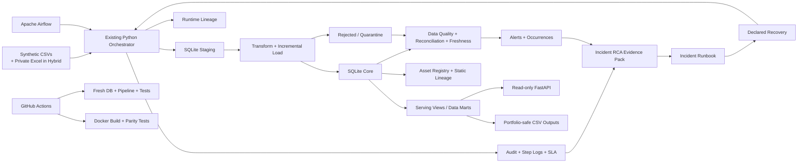

# SQL E-commerce Data Engineering

[](https://github.com/bodinkc30-Pete/sql-ecommerce-data-engineering/actions/workflows/ci.yml)

A production-style Data Engineering portfolio project built around a reproducible SQLite e-commerce pipeline, extended with reliability engineering, data quality, observability, incident response, Airflow orchestration, a read-only FastAPI serving layer, Docker, performance validation, and GitHub Actions CI.

The repository supports two execution modes:

- **Demo Mode** — fully reproducible from version-controlled synthetic e-commerce CSV files.
- **Hybrid Mode** — runs the same pipeline while additionally processing a private Pawchoice influencer-payment workbook that remains outside Git and Docker images.

The public repository is intentionally safe to clone, inspect, test, and run without access to private business data.

---

## Project at a Glance

| Area | Current implementation |
|---|---|
| Business datastore | **SQLite** |
| Physical SQLite tables | **25** |
| SQLite views | **20** |
| Explicit named indexes | **57** |
| Automated tests | **193** |
| Demo-mode expected skips | **4** |
| Data-quality SQL packs | **7** |
| Governance assets | **32** |
| Dataset lineage edges | **34** |
| Portfolio-safe CSV outputs | **6** |
| Orchestration | Existing Python orchestrator + **Apache Airflow 3.3.0** wrapper |
| Airflow executor | **LocalExecutor** |
| Airflow metadata DB | **PostgreSQL 17** |
| Serving layer | **FastAPI**, read-only SQLite access |
| Monitoring | Audit, step telemetry, SLA metrics, alerts, occurrences |
| Incident response | RCA SQL evidence pack + recovery contract + runbook |
| Containerization | Python 3.12 slim app image + separate Airflow stack |
| CI/CD | GitHub Actions host validation + Docker parity validation |

Current verified Demo Mode regression result:

```text
Ran 193 tests
OK (skipped=4)
```

The four expected skips are Pawchoice-data tests that require the private workbook and are intentionally skipped in public Demo Mode.

---

## What This Project Proves

This project is designed to demonstrate practical Data Engineering work beyond basic SQL or one-off ETL.

It includes:

- Multi-source CSV / Excel ingestion
- Staging-to-core relational architecture
- Structural data contracts and schema-drift detection
- SQL transformations and UPSERT patterns
- Incremental loading with watermarks and lookback
- Idempotent duplicate-delivery handling
- Referential-integrity quarantine
- Invalid-payment quarantine
- Data quality, reconciliation, and freshness gates
- Failure injection and regression tests
- SQLite lock retry for transient operational failures
- Pipeline run / step / SLA telemetry
- Stable alert fingerprinting and deduplication
- Alert occurrence history and reopen semantics
- Alert lifecycle management
- Recovery metadata linked to the failed run
- Incident RCA queries and an incident runbook
- Dataset-level and runtime lineage
- Data asset registry and PII classification
- Query-plan validation and performance regression tests
- Business-serving views with aggregation-grain tests
- Read-only REST API endpoints
- Airflow orchestration without duplicating pipeline logic
- Docker execution and CI parity validation
- Portfolio-safe public outputs

---

# Architecture

The full architecture is documented in:

- [Pipeline Architecture](diagrams/pipeline_architecture.md)
- [Database ER Diagram](diagrams/database_er_diagram.md)
- [Incident Response and Recovery Runbook](docs/INCIDENT_RUNBOOK.md)

High-level flow:



### Architecture principle: Airflow wraps the pipeline

Airflow is deliberately an orchestration layer, not a second implementation of the business pipeline.

The DAG executes the existing orchestrator:

```text
python /opt/project/scripts/05_run_pipeline.py
```

That keeps ingestion, transformation, quality, telemetry, retry, alerting, and recovery behavior in one implementation.

### Business data versus Airflow metadata

Project 01 business data remains in SQLite.

PostgreSQL is used only by the Airflow stack for Airflow metadata.

---

# Execution Modes

Mode is configured in:

```text
config/pipeline_config.json
```

## Demo Mode

```json
{
  "pipeline": {
    "mode": "demo"
  }
}
```

Demo Mode:

- Uses version-controlled synthetic CSV inputs
- Does not require private Pawchoice files
- Skips private-source ingestion
- Runs the public pipeline, monitoring, lineage, quality, serving, exports, tests, Docker validation, and CI
- Is the required CI mode
- Is the recommended reviewer mode

## Hybrid Mode

```json
{
  "pipeline": {
    "mode": "hybrid"
  }
}
```

Hybrid Mode additionally:

- Loads the private Pawchoice influencer-payment workbook
- Builds campaign / influencer / influencer-payment records
- Hashes or masks sensitive values
- Quarantines invalid rows
- Preserves source file / sheet / row lineage

The private workbook is not committed to the public repository.

---

# Data Sources

## Synthetic e-commerce data

Public inputs:

```text
data/raw/synthetic/
├── customers.csv
├── products.csv
├── orders.csv
├── order_items.csv
└── payments.csv
```

Current Demo Mode input volume:

```text
customers.csv       5 rows
products.csv        5 rows
orders.csv          5 rows
order_items.csv     7 rows
payments.csv        5 rows
---------------------------
Total              27 rows
```

## Private Pawchoice workbook

Hybrid Mode can use:

```text
data/raw/pawchoice/pawchoice_payments.xlsx
```

The raw workbook may contain personal and financial information and is intentionally excluded from Git and Docker images.

---

# Pipeline Stages

The end-to-end orchestrator is:

```text
scripts/05_run_pipeline.py
```

It executes four main pipeline stages.

## 1. SETUP_DATABASE

```text
scripts/01_setup_database.py
```

Responsibilities:

- Build SQLite objects from repository schema files
- Recreate the project database from source-controlled SQL
- Validate required tables, views, and indexes
- Seed governance metadata
- Validate lineage references
- Validate PII classification
- Validate SQLite integrity

Current fresh-database contract:

```text
Tables:  25
Views:   20
Indexes: 57
Assets:  32
Lineage edges: 34
```

## 2. LOAD_RAW_DATA

```text
scripts/02_load_raw_data.py
```

Responsibilities:

- Load synthetic CSVs into staging
- Load the private workbook in Hybrid Mode
- Validate expected source structure
- Detect missing files and schema drift
- Preserve source-location metadata
- Respect Demo / Hybrid execution mode

## 3. RUN_TRANSFORMATIONS

```text
scripts/03_run_transformations.py
```

Responsibilities:

- Clean and standardize source values
- Execute incremental transformations
- Load core relational tables
- Apply UPSERT / idempotency behavior
- Quarantine invalid source records
- Protect sensitive fields
- Update watermark state
- Preserve run-linked metadata

## 4. RUN_QUALITY_CHECKS

```text
scripts/04_run_quality_checks.py
```

Seven SQL quality packs execute:

```text
quality_checks/
├── 01_null_checks.sql
├── 02_duplicate_checks.sql
├── 03_referential_integrity.sql
├── 04_reconciliation_checks.sql
├── 05_business_rule_checks.sql
├── 06_influencer_payment_checks.sql
└── 07_freshness_checks.sql
```

A clean Demo Mode run currently produces:

```text
CRITICAL=0
ERROR=0
WARNING=0
```

---

# SQLite Data Model

The authoritative ER documentation is:

[Database ER Diagram](diagrams/database_er_diagram.md)

The physical schema contains **25 tables**.

## Staging — 6 tables

```text
stg_customers
stg_products
stg_orders
stg_order_items
stg_payments
stg_influencer_payments
```

## E-commerce core — 5 tables

```text
customers
products
orders
order_items
payments
```

## Influencer-payment core — 3 tables

```text
campaigns
influencers
influencer_payments
```

## Quarantine — 2 tables

```text
rejected_influencer_records
rejected_source_records
```

## Pipeline operations / observability — 6 tables

```text
pipeline_watermark
pipeline_audit
pipeline_step_log
pipeline_sla_metrics
pipeline_alerts
pipeline_alert_occurrences
```

## Governance / lineage — 3 tables

```text
data_assets
lineage_edges
lineage_run_events
```

---

# Incremental Loading and Idempotency

Incremental loading is implemented through the project transformation layer and `pipeline_watermark`.

Current reliability configuration includes:

```text
Incremental lookback:        10 minutes
Future watermark tolerance:   5 minutes
```

The lookback allows late-arriving records to be reconsidered.

Idempotency is protected through:

- Unique business keys
- UPSERT behavior
- Record hashes
- Duplicate-delivery regression tests
- Rejected-record deduplication
- Watermark handling

The automated suite includes a duplicate-delivery test proving that repeated delivery does not duplicate trusted core rows.

---

# Structural Data Contracts

The ingestion layer rejects incompatible source structure before unsafe processing.

Covered cases include:

- Missing required columns
- Unexpected columns
- Duplicate headers
- Flexible column order
- Missing required source files

This allows the project to distinguish a source contract break from a downstream transformation problem.

---

# Data Quality

The quality system covers:

- Required values
- Duplicate keys
- Duplicate source rows
- Referential integrity
- Reconciliation
- Business rules
- Allowed status values
- Invalid / negative amounts
- Privacy validation
- Rejected-record evidence
- Freshness

## Quality severity policy

```text
WARNING   report only
ERROR     threshold-based
CRITICAL  any occurrence fails
```

Current ERROR tolerance:

```text
Maximum issue count: 5
Maximum issue rate:  1%
```

Current reconciliation amount tolerance:

```text
0.01
```

---

# Freshness Quality Gate

Freshness validation is implemented in:

```text
quality_checks/07_freshness_checks.sql
```

Supported states include:

```text
FRESH
STALE_DATA
NOT_LOADED
```

Regression tests explicitly prove:

- Fresh watermark passes
- Stale data fails the quality gate
- Never-loaded required data is treated as critical

---

# Quarantine and Rejected Records

Instead of silently dropping bad data or forcing it into trusted tables, Project 01 keeps rejection evidence.

Examples include:

- Invalid payment amount
- Orphaned order / broken reference
- Missing campaign or influencer data
- Invalid status
- Invalid fee amount
- Structurally invalid source rows

Generic rejection evidence may include:

```text
run_id
dataset_name
source_file
source_row_number
raw_record_json
rejected_column
rejected_value
rejection_reason
rejection_type
rejected_at
```

`rejected_source_records.run_id` is nullable because not every source failure can be durably linked to a pipeline run.

---

# Privacy and PII Protection

The public repository intentionally excludes raw private source artifacts.

| Sensitive field | Public/runtime handling |
|---|---|
| Bank account | SHA-256 hash |
| Phone | SHA-256 hash |
| Account name | Masked |
| Notes | Sanitized |
| Source position | Preserved as lineage metadata |

Private Pawchoice input, runtime databases, runtime logs, secrets, and generated private artifacts are excluded through repository / Docker ignore rules.

The public API does not expose private raw-source paths or raw sensitive error details.

---

# Governance and Lineage

## Data Asset Registry

```text
data_assets
```

Current fresh seed:

```text
32 assets
```

Metadata includes:

- Stable asset key
- Asset type
- Data layer
- Data domain
- Source system
- Physical / logical location
- Data format
- Classification
- PII flag
- Owner
- Active status

## Static dataset lineage

```text
lineage_edges
```

Current graph:

```text
34 dataset-level lineage edges
```

## Runtime lineage

```text
lineage_run_events
```

The project separates static lineage from execution evidence.

Runtime event states include:

```text
SUCCESS
FAILED
SKIPPED
```

In Demo Mode, private-source lineage can be recorded as skipped rather than disappearing from history.

## Recursive dependency views

```text
vw_asset_upstream_dependencies
vw_asset_downstream_dependencies
```

These allow multi-hop dependency tracing, for example:

```text
orders.csv
  ↓
stg_orders
  ↓
orders
  ↓
vw_daily_sales_summary
```

---

# Monitoring and SLA

Operational telemetry is stored in:

```text
pipeline_audit
pipeline_step_log
pipeline_sla_metrics
```

Recorded evidence includes:

- Pipeline name
- Run ID
- Run type
- Recovery linkage
- Step number / name
- Script name
- Attempt number
- Status
- Start / end timestamp
- Duration
- Rows read / written / rejected
- Error type / message
- SLA threshold
- SLA state

Current Demo Mode SLA thresholds:

```text
SETUP_DATABASE        10 seconds
LOAD_RAW_DATA         30 seconds
RUN_TRANSFORMATIONS   15 seconds
RUN_QUALITY_CHECKS    10 seconds
```

SLA states:

```text
ON_TIME
BREACHED
NOT_EVALUATED
```

---

# Monitoring Alerts

Project 01 has durable alert state plus occurrence history.

Tables:

```text
pipeline_alerts
pipeline_alert_occurrences
```

Monitoring view:

```text
vw_pipeline_alert_monitoring
```

Alert types include:

```text
STEP_FAILURE
SLA_BREACH
DATA_QUALITY_WARNING
DATA_QUALITY_FAILURE
```

Severity values:

```text
CRITICAL
ERROR
WARNING
```

Stable fingerprints allow the same operational failure across different runs to map to one alert while retaining separate occurrence evidence.

Resolved alerts reopen when the same problem recurs.

Alert-write failures are intentionally non-blocking so a secondary observability failure does not hide or replace the primary pipeline result.

## Alert lifecycle

```text
OPEN → ACKNOWLEDGED → RESOLVED
```

Manage an alert:

```bash
python scripts/07_manage_alerts.py acknowledge <ALERT_ID>
python scripts/07_manage_alerts.py resolve <ALERT_ID>
```

An OPEN alert cannot jump directly to RESOLVED.

---

# Retry and Database Lock Handling

The orchestrator includes retry handling for retryable SQLite operational errors such as transient database locks.

Regression tests prove:

- Non-retryable DB errors fail immediately
- A transient lock retries and can succeed
- A persistent lock exhausts the retry budget and fails

This is intentionally narrower than retrying every exception.

---

# Recovery Contract

Pipeline audit records distinguish:

```text
NORMAL
RECOVERY
BACKFILL
```

A declared recovery must point to a valid failed top-level pipeline run.

Run a declared recovery:

```bash
python scripts/05_run_pipeline.py --recovery-of <FAILED_RUN_ID>
```

The recovery run records:

```text
recovery_of_run_id
```

This prevents a later unrelated successful run from being incorrectly described as the recovery of an earlier incident.

Recovery and backfill arguments are separate execution modes and are not combined.

---

# Incident Troubleshooting

Incident evidence queries live in:

```text
queries/05_incident_troubleshooting.sql
```

The pack is read-only and contains nine troubleshooting statements covering:

1. Recent run inventory
2. Latest incident summary
3. Step evidence with audit fallback
4. SLA evidence
5. Rejected-source evidence
6. Runtime lineage evidence
7. Failure-to-recovery mapping
8. Quality / reconciliation evidence
9. Current freshness / watermark state

Operating rule:

**Do not guess root cause. Use recorded evidence.**

Runbook:

[Incident Response and Recovery Runbook](docs/INCIDENT_RUNBOOK.md)

The runbook includes failure scenarios for missing sources, schema drift, invalid / orphaned records, database locks, stale data, quality-gate failure, and SLA breach.

---

# Business Serving Layer

The SQLite serving layer includes operational and business-facing views such as:

```text
vw_daily_sales_summary
vw_product_sales_summary
vw_customer_order_summary
vw_payment_summary
vw_payment_reconciliation
vw_pipeline_run_summary
vw_data_quality_summary
vw_pipeline_alert_monitoring
```

Business calculation tests use controlled fixtures to validate aggregation semantics.

For example, Average Order Value is computed at **order grain** rather than incorrectly averaging order totals after joining orders to multiple line items.

That prevents a common 1:N join aggregation bug from silently producing plausible-but-wrong metrics.

---

# Read-only REST API

FastAPI application:

```text
api/app.py
```

The API opens SQLite with explicit read-only access.

Start it after creating the database:

```bash
uvicorn api.app:app --host 0.0.0.0 --port 8000
```

Interactive API documentation is then available at:

```text
http://localhost:8000/docs
```

## Endpoints

```text
GET /health
GET /api/v1/sales/daily
GET /api/v1/products/sales
GET /api/v1/pipelines/runs
GET /api/v1/quality/issues
GET /api/v1/alerts
```

Supported filters include date range, category, run status, quality source, alert status, alert severity, and bounded result limits.

The serving layer intentionally does not expose business-data mutation routes.

---

# Apache Airflow Orchestration

Airflow files:

```text
Dockerfile.airflow
docker-compose.airflow.yml
airflow/dags/ecommerce_pipeline_dag.py
```

Current design:

```text
Airflow:       3.3.0
Python:        3.12
Executor:      LocalExecutor
Metadata DB:   PostgreSQL 17
DAG:           project01_ecommerce_pipeline
Schedule:      @daily
Catchup:       false
Max active:    1 run
Retries:       2
Retry delay:   5 minutes
API host port: 8081
```

Start the stack:

```bash
docker compose -f docker-compose.airflow.yml up --build -d
```

Inspect services:

```bash
docker compose -f docker-compose.airflow.yml ps
```

Airflow web/API server:

```text
http://localhost:8081
```

Stop the stack:

```bash
docker compose -f docker-compose.airflow.yml down
```

Airflow wraps the existing pipeline; it does not reimplement pipeline logic inside the DAG.

---

# Performance Engineering

Performance validation:

```text
queries/04_performance_validation.sql
```

Benchmark utility:

```text
scripts/08_performance_benchmark.py
```

The benchmark creates an isolated database using:

```text
100,000 orders
100,000 payments
20 timed rounds per query
```

Production composite indexes include:

```text
idx_orders_status_date(order_status, order_date)
idx_payments_date_status(payment_date, payment_status)
```

Performance regression tests also verify that representative query plans use the expected composite indexes.

Observed optimization-phase benchmark:

```text
DAILY_SALES
Before: 7.906 ms
After : 6.768 ms
Speedup: 1.17x

PAYMENT_DAILY
Before: 44.102 ms
After : 22.316 ms
Speedup: 1.98x
```

Benchmark timings vary by hardware, OS, SQLite version, and system load.

---

# Automated Testing

Run the complete suite:

```bash
python -m unittest discover -s tests -p "test_*.py" -v
```

Current verified Demo Mode result:

```text
Ran 193 tests
OK (skipped=4)
```

Coverage includes:

- Fresh database creation
- Schema object counts
- Foreign-key integrity
- Structural source contracts
- Missing-file failure
- Incremental loading
- Duplicate-delivery idempotency
- Referential-integrity quarantine
- Invalid-payment quarantine
- Freshness quality gate
- Data-quality SQL
- Reconciliation
- Privacy and masking
- Governance and lineage
- Runtime lineage
- Recovery contract / metadata
- Incident troubleshooting queries
- Database-lock retry
- Alert schema / fingerprinting
- Alert occurrence history
- Alert deduplication
- Alert reopen semantics
- Alert lifecycle
- Alert resilience
- Monitoring schema contract
- Business-serving calculations
- Query-plan / performance regression
- REST API contract and integration
- Airflow file / compose / execution-routing contracts

Four tests are skipped in Demo Mode because they require the private Pawchoice workbook.

---

# Failure Engineering

The repository intentionally tests failures instead of validating only the happy path.

Examples include:

- Required source file missing
- Required source column missing
- Unexpected source column
- Duplicate header
- Invalid payment amount
- Orphaned order
- Stale watermark
- Required dataset never loaded
- Duplicate source delivery
- SQLite database lock
- Pipeline step failure
- SLA breach
- Alert persistence failure
- Invalid recovery target
- Business aggregation grain bug

These scenarios provide concrete evidence for the project's **Break → Troubleshoot → Recover** workflow.

---

# Fresh-Database Reproducibility

Run:

```bash
python -m unittest tests.test_fresh_database_setup -v
```

Expected:

```text
Ran 4 tests
OK
```

The test creates a temporary SQLite database from repository source and verifies:

```text
25 tables
20 views
57 explicit named indexes
32 seeded data assets
34 dataset lineage edges
0 initial runtime lineage events
clean foreign-key integrity
valid PII classification
correct recursive lineage
```

This protects against a common local-development failure mode where the project works only because a developer already has a manually patched database.

---

# Portfolio-safe Outputs

Export:

```bash
python scripts/06_export_portfolio_outputs.py
```

Generated public-safe files:

```text
data/processed/
├── sample_campaign_payment_summary.csv
├── sample_data_quality_summary.csv
├── sample_ecommerce_daily_sales.csv
├── sample_payment_status_summary.csv
├── sample_pipeline_run_summary.csv
└── sample_rejected_record_summary.csv
```

These are designed for portfolio review without exposing private raw PII.

---

# Local Setup

Clone:

```bash
git clone https://github.com/bodinkc30-Pete/sql-ecommerce-data-engineering.git
cd sql-ecommerce-data-engineering
```

Install dependencies:

```bash
python -m pip install -r requirements.txt
```

Runtime / test dependencies currently declared:

```text
openpyxl==3.1.5
fastapi>=0.115,<1.0
uvicorn>=0.30,<1.0
httpx2>=2.10,<3.0
```

Run the complete Demo Mode pipeline:

```bash
python scripts/05_run_pipeline.py
```

Export outputs:

```bash
python scripts/06_export_portfolio_outputs.py
```

Run tests:

```bash
python -m unittest discover -s tests -p "test_*.py" -v
```

---

# Docker

Application image:

```text
Dockerfile
python:3.12-slim
non-root appuser
```

Build:

```bash
docker build -t sql-ecommerce-data-engineering:demo .
```

Run:

```bash
docker run --rm --name sql-ecommerce-demo sql-ecommerce-data-engineering:demo
```

Full parity validation:

```bash
docker run --rm \
  --name sql-ecommerce-docker-validation \
  sql-ecommerce-data-engineering:demo \
  sh -c "python -m unittest tests.test_fresh_database_setup -v && python scripts/05_run_pipeline.py && python scripts/06_export_portfolio_outputs.py && python -m unittest discover -s tests -p 'test_*.py' -v"
```

The Docker validation intentionally performs fresh-database setup, pipeline execution, export, and the complete test suite in one container.

---

# GitHub Actions CI

Workflow:

```text
.github/workflows/ci.yml
```

Runs on:

- Push to `main`
- Pull requests targeting `main`

## Job 1 — Run Demo Pipeline and Tests

Validates:

1. Checkout
2. Python 3.12
3. Dependency installation
4. Demo Mode
5. Fresh-database reproducibility
6. End-to-end pipeline
7. Portfolio-safe export
8. Full automated suite
9. Artifact upload

## Job 2 — Build and Test Docker Image

Validates:

1. Docker build
2. Fresh setup inside the image
3. Pipeline execution
4. Portfolio export
5. Complete test suite inside Docker

The workflow therefore checks both the direct Python execution path and container parity.

Successful runs upload Demo Mode artifacts containing generated outputs, the SQLite database, and the pipeline log.

---

# Project Structure

Key repository layout:

```text
sql-ecommerce-data-engineering/
├── .github/
│   └── workflows/
│       └── ci.yml
│
├── airflow/
│   └── dags/
│       └── ecommerce_pipeline_dag.py
│
├── api/
│   ├── __init__.py
│   └── app.py
│
├── config/
│   └── pipeline_config.json
│
├── data/
│   ├── raw/
│   │   ├── synthetic/
│   │   └── pawchoice/
│   └── processed/
│
├── database/
├── diagrams/
│   ├── pipeline_architecture.md
│   └── database_er_diagram.md
│
├── docs/
│   ├── INCIDENT_RUNBOOK.md
│   └── images/
│
├── quality_checks/
│   └── 01...07 SQL quality packs
│
├── queries/
│   ├── 01_pipeline_monitoring.sql
│   ├── 02_load_audit_analysis.sql
│   ├── 03_data_freshness_checks.sql
│   ├── 04_performance_validation.sql
│   └── 05_incident_troubleshooting.sql
│
├── schema/
│   └── 01...13 schema / governance SQL files
│
├── scripts/
│   ├── 01_setup_database.py
│   ├── 02_load_raw_data.py
│   ├── 03_run_transformations.py
│   ├── 04_run_quality_checks.py
│   ├── 05_run_pipeline.py
│   ├── 06_export_portfolio_outputs.py
│   ├── 07_manage_alerts.py
│   └── 08_performance_benchmark.py
│
├── tests/
│   └── regression / contract / integration tests
│
├── transformations/
│   └── transformation SQL
│
├── Dockerfile
├── Dockerfile.airflow
├── docker-compose.airflow.yml
├── requirements.txt
└── README.md
```

---

# Key Engineering Decisions

## Why SQLite remains in Project 01

This project is intentionally scoped as a reliable single-node SQL Data Engineering system.

The objective is to demonstrate engineering depth around correctness, reliability, operations, testing, serving, and incident handling without hiding those concepts behind a distributed stack.

Airflow's PostgreSQL database is Airflow metadata only; it is not a migration of the Project 01 business datastore.

## Why Demo and Hybrid modes coexist

A portfolio must be reproducible by reviewers, while the original real-world ingestion workflow should remain exercisable locally.

Demo Mode solves public reproducibility.

Hybrid Mode preserves private-source realism without publishing private data.

## Why bad rows are quarantined

Operational systems need evidence.

Dropping invalid data silently loses the information required for reconciliation and RCA. Project 01 therefore stores rejected records with reasons and source location whenever possible.

## Why alerts have a fingerprint and occurrence history

One underlying failure can happen repeatedly across runs.

A stable fingerprint prevents alert spam, while occurrence rows preserve each detection as evidence.

## Why alert writes are non-blocking

The monitoring subsystem is secondary to the primary pipeline outcome.

A failed alert write should not convert a successful business step into a failed step, or overwrite the real reason a failed step failed.

## Why recovery is linked explicitly

A later success is not automatically a recovery.

`recovery_of_run_id` creates durable evidence that a recovery run was intentionally executed for one specific failed run.

## Why Airflow does not contain business logic

Duplicating the pipeline inside a DAG would create two implementations to maintain and test.

The DAG therefore invokes the existing orchestrator.

## Why the REST API is read-only

Project 01's serving layer exists to expose curated operational / business information, not to become a transactional application.

Explicit read-only SQLite access also protects the data-engineering execution path from accidental API writes.

## Why fresh-database testing is mandatory

A repository is not reproducible if it depends on a developer's pre-existing local database.

The fresh-database contract rebuilds the database from repository source and checks schema, governance, lineage, and integrity.

---

# Six-dimension Engineering Evidence

This project is designed to demonstrate a complete engineering loop.

| Dimension | Evidence |
|---|---|
| **Build** | Ingestion, transformations, schema, quality, serving API, Airflow, Docker |
| **Operate** | Orchestrator, run IDs, telemetry, SLA, alerts, Airflow scheduling |
| **Break** | Failure injection, malformed data, stale data, lock failures, aggregation bug |
| **Troubleshoot** | Audit/step/SLA evidence, RCA SQL pack, incident runbook |
| **Optimize** | Composite indexes, query plans, benchmark, regression tests |
| **Explain** | README, architecture diagram, ER diagram, incident evidence and design decisions |

---

# Scope Boundaries

Project 01 intentionally does **not** claim to implement:

- Spark
- Databricks
- Kafka
- Flink
- Delta Lake
- Medallion / Bronze-Silver-Gold architecture
- Cloud deployment
- Distributed processing

Those technologies belong in other projects where they can be demonstrated properly instead of being added superficially to this repository.

Possible future engineering extensions for Project 01 itself would be limited to changes that preserve its current scope, such as stronger schema migration tooling or additional operational visualization.

---

# Repository Safety Checklist

Before commit / push:

```bash
git status --short
```

Do not commit private or runtime-only artifacts such as:

```text
data/raw/pawchoice/pawchoice_payments.xlsx
data/raw/pawchoice/*.pdf
database/*.db
database/docker/
logs/*.log
logs/docker/
data/processed/docker/
.env
.venv/
__pycache__/
```

The public repository should contain only safe source code, SQL, configuration, synthetic inputs, tests, documentation, Docker / Airflow definitions, CI configuration, and portfolio-safe outputs.

---

# Author

**Bodin Krongchon**

Data Engineering Portfolio Project

Focused on building reliable, testable, privacy-aware, reproducible, observable, recoverable, and explainable data pipelines.
