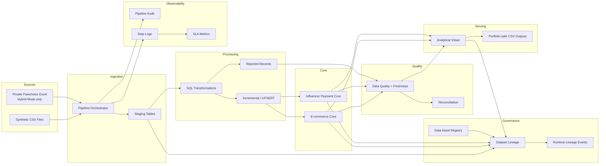

# SQL E-commerce Data Engineering

[](https://github.com/bodinkc30-Pete/sql-ecommerce-data-engineering/actions/workflows/ci.yml)

A production-style data engineering portfolio project that demonstrates reliable ingestion, staging, transformation, incremental loading, data quality, recovery, monitoring, governance, lineage, performance tuning, automated testing, Docker execution, and CI validation.

The repository supports two execution modes:

- **Demo Mode** — fully reproducible from version-controlled synthetic e-commerce CSV files.
- **Hybrid Mode** — extends the same pipeline with a private real-world Pawchoice influencer-payment workbook while keeping sensitive source data out of Git and Docker images.

The public repository is intentionally safe to clone and run without private business data.

---

## Project Highlights

| Area | Current implementation |
|---|---|
| Database | SQLite |
| Tables | **22** |
| Views | **19** |
| Explicit named indexes | **49** |
| Automated tests | **71** |
| Demo-mode expected skips | **4** |
| Governance assets | **32** |
| Dataset lineage edges | **34** |
| Data-quality SQL checks | **7** |
| Portfolio-safe CSV outputs | **6** |
| Docker | Python 3.12 slim, non-root runtime |
| CI/CD | GitHub Actions + Docker validation |
| Fresh-clone validation | Automated fresh-database reproducibility test |

Current verified Demo Mode test result:

```text
Ran 71 tests
OK (skipped=4)
```

The four skipped tests require the private Pawchoice workbook and are expected in Demo Mode.

---

## What This Project Demonstrates

This project focuses on practical Data Engineering capabilities rather than only analytical SQL.

It demonstrates:

- Multi-source ingestion from CSV and Excel
- Staging-to-core data architecture
- Relational modeling and referential integrity
- SQL-based transformations
- Incremental loading with watermark state
- Lookback handling for late-arriving records
- Idempotent reprocessing
- Retry, recovery, and backfill-oriented execution design
- Data freshness validation
- Data quality thresholds and severity policies
- Reconciliation checks
- Rejected-record / dead-letter handling
- Pipeline auditing and step-level monitoring
- SLA monitoring
- PII hashing, masking, and sanitization
- Data asset registry
- Dataset-level lineage
- Runtime lineage event history
- Recursive upstream/downstream dependency tracing
- Query-plan inspection with `EXPLAIN QUERY PLAN`
- Composite-index optimization
- Repeatable performance benchmarking
- Automated unit and acceptance tests
- Fresh-database reproducibility validation
- Dockerized execution
- GitHub Actions CI
- Portfolio-safe exports

---

## Architecture



Additional diagrams:

- [Pipeline Architecture](diagrams/pipeline_architecture.md)
- [Database ER Diagram](diagrams/database_er_diagram.md)

---

## Data Sources

### 1. Synthetic e-commerce transactions

The public Demo Mode includes:

```text
data/raw/synthetic/
├── customers.csv
├── products.csv
├── orders.csv
├── order_items.csv
└── payments.csv
```

These files allow anyone to clone the repository and reproduce the pipeline without private data.

### 2. Pawchoice influencer-payment workbook

Hybrid Mode can process a private workbook placed locally at:

```text
data/raw/pawchoice/pawchoice_payments.xlsx
```

Expected worksheet:

```text
สรุปรอบจ่าย
```

The source contains multiple payment sections and repeated headers within the same worksheet.

The real workbook is intentionally excluded from Git because it may contain personal and financial information.

See:

```text
data/raw/pawchoice/README.md
```

---

## Execution Modes

The selected mode is configured in:

```text
config/pipeline_config.json
```

### Demo Mode

```json
"mode": "demo"
```

Demo Mode:

- Uses only public synthetic CSV data
- Does not require the Pawchoice workbook
- Skips Pawchoice ingestion and private-source transformations
- Runs monitoring, governance, lineage, transformations, quality checks, exports, and tests normally
- Is the default mode for GitHub Actions and Docker
- Is the recommended mode for reviewers

### Hybrid Mode

```json
"mode": "hybrid"
```

Hybrid Mode:

- Loads the five synthetic CSV files
- Loads the private Pawchoice workbook
- Processes campaign, influencer, and influencer-payment data
- Applies privacy protection
- Routes invalid source rows to rejected records
- Preserves source lineage

Supported values:

```text
demo
hybrid
```

---

## Project Structure

```text
sql-ecommerce-data-engineering/
├── .github/
│   └── workflows/
│       └── ci.yml
│
├── config/
│   └── pipeline_config.json
│
├── data/
│   ├── raw/
│   │   ├── synthetic/
│   │   │   ├── customers.csv
│   │   │   ├── products.csv
│   │   │   ├── orders.csv
│   │   │   ├── order_items.csv
│   │   │   └── payments.csv
│   │   └── pawchoice/
│   │       ├── .gitkeep
│   │       └── README.md
│   ├── staging/
│   │   └── .gitkeep
│   └── processed/
│       ├── .gitkeep
│       └── sample_*.csv
│
├── database/
│   └── .gitkeep
│
├── diagrams/
│   ├── pipeline_architecture.md
│   └── database_er_diagram.md
│
├── docs/
│   └── images/
│       ├── pipeline_success.png
│       ├── quality_checks_passed.png
│       └── automated_tests_passed.png
│
├── logs/
│   └── .gitkeep
│
├── quality_checks/
│   ├── 01_null_checks.sql
│   ├── 02_duplicate_checks.sql
│   ├── 03_referential_integrity.sql
│   ├── 04_reconciliation_checks.sql
│   ├── 05_business_rule_checks.sql
│   ├── 06_influencer_payment_checks.sql
│   └── 07_freshness_checks.sql
│
├── queries/
│   ├── 01_pipeline_monitoring.sql
│   ├── 02_load_audit_analysis.sql
│   ├── 03_data_freshness_checks.sql
│   └── 04_performance_validation.sql
│
├── schema/
│   ├── 01_create_staging_tables.sql
│   ├── 02_create_core_tables.sql
│   ├── 03_create_indexes.sql
│   ├── 04_create_views.sql
│   ├── 05_create_governance_tables.sql
│   ├── 06_seed_data_assets.sql
│   ├── 07_create_lineage_edges.sql
│   ├── 08_seed_lineage_edges.sql
│   ├── 09_correct_lineage_edges.sql
│   ├── 10_create_lineage_run_events.sql
│   ├── 11_create_governance_views.sql
│   ├── 12_fix_governance_dependency_views.sql
│   └── 13_fix_pii_classification.sql
│
├── scripts/
│   ├── 01_setup_database.py
│   ├── 02_load_raw_data.py
│   ├── 03_run_transformations.py
│   ├── 04_run_quality_checks.py
│   ├── 05_run_pipeline.py
│   ├── 06_export_portfolio_outputs.py
│   └── 08_performance_benchmark.py
│
├── tests/
│   ├── test_fresh_database_setup.py
│   ├── test_governance_lineage.py
│   ├── test_incremental_load.py
│   ├── test_quality_checks.py
│   ├── test_schema.py
│   └── test_transformations.py
│
├── transformations/
│   ├── 01_clean_customers.sql
│   ├── 02_clean_products.sql
│   ├── 03_clean_orders.sql
│   ├── 04_clean_order_items.sql
│   ├── 05_clean_payments.sql
│   ├── 06_incremental_load.sql
│   └── 07_clean_influencer_payments.sql
│
├── .dockerignore
├── .gitignore
├── Dockerfile
├── README.md
└── requirements.txt
```

---

## Pipeline Stages

### 1. Database setup

```text
scripts/01_setup_database.py
```

Creates and validates the project database from a fresh state.

Current fresh-database result:

```text
Tables: 22
Views: 19
Indexes: 49
```

The setup process executes all schema files in order and validates required database objects, governance metadata, PII classifications, lineage references, and SQLite integrity.

### 2. Raw-data ingestion

```text
scripts/02_load_raw_data.py
```

Responsibilities:

- Load synthetic CSV files into staging
- Load Pawchoice Excel data in Hybrid Mode
- Track source file and source-row location where applicable
- Respect pipeline execution mode
- Prepare data for deterministic transformation

Current Demo Mode input:

```text
customers.csv      5 rows
products.csv       5 rows
orders.csv         5 rows
order_items.csv    7 rows
payments.csv       5 rows
-------------------------
Total             27 rows
```

### 3. Transformations

```text
scripts/03_run_transformations.py
```

Responsibilities:

- Clean and normalize source values
- Standardize statuses
- Apply UPSERT logic
- Load relational core tables
- Protect sensitive fields
- Route invalid rows into rejected records
- Support incremental execution behavior

### 4. Data-quality checks

```text
scripts/04_run_quality_checks.py
```

The pipeline executes seven SQL quality-check files:

```text
01_null_checks.sql
02_duplicate_checks.sql
03_referential_integrity.sql
04_reconciliation_checks.sql
05_business_rule_checks.sql
06_influencer_payment_checks.sql
07_freshness_checks.sql
```

### 5. End-to-end orchestration

```text
scripts/05_run_pipeline.py
```

The orchestrator:

- Creates one pipeline `run_id`
- Executes steps in order
- Records step attempts
- Records runtime metrics
- Evaluates SLA thresholds
- Links runtime lineage events to pipeline execution
- Supports recovery-oriented execution metadata
- Stops on non-tolerated failures

### 6. Portfolio-safe export

```text
scripts/06_export_portfolio_outputs.py
```

Exports analytical CSV files designed for portfolio review without exposing private personal information.

### 7. Performance benchmark

```text
scripts/08_performance_benchmark.py
```

Creates an isolated benchmark database with:

```text
100,000 orders
100,000 payments
20 timed rounds per query
```

The benchmark compares baseline single-column indexing against optimized composite indexing and prints both query plans and timing results.

---

## Database Model

### E-commerce core

```text
customers
products
orders
order_items
payments
```

Relationships:

```text
customers ──< orders
orders    ──< order_items
products  ──< order_items
orders    ──< payments
```

### Influencer-payment domain

```text
campaigns
influencers
influencer_payments
rejected_influencer_records
```

Relationships:

```text
campaigns   ──< influencer_payments
influencers ──< influencer_payments
```

### Pipeline metadata

```text
pipeline_audit
pipeline_step_log
pipeline_sla_metrics
pipeline_watermark
```

### Governance metadata

```text
data_assets
lineage_edges
lineage_run_events
```

---

## Incremental Loading

Incremental loading is implemented in:

```text
transformations/06_incremental_load.sql
```

The pipeline uses `pipeline_watermark` to track the most recent processed timestamp.

Current reliability settings include:

```text
Incremental lookback: 10 minutes
Future watermark tolerance: 5 minutes
```

The lookback window allows late-arriving records to be reconsidered safely.

Unique keys, UPSERT logic, and repeatable transformations preserve idempotency when the same data is processed more than once.

---

## Retry, Recovery, and Backfill Design

The pipeline includes reliability-oriented execution behavior for common operational scenarios.

Supported concepts include:

- Normal execution
- Retry attempts
- Recovery metadata
- Backfill date ranges
- Late-arriving data handling
- Watermark protection
- Idempotent reruns
- Failure-aware audit records

Pipeline execution metadata can distinguish:

```text
NORMAL
RECOVERY
BACKFILL
```

This allows operational history to retain why a run occurred rather than treating every execution as identical.

---

## Freshness and STALE_DATA Detection

Freshness checks are implemented in:

```text
quality_checks/07_freshness_checks.sql
```

The check evaluates the most recent load timestamp for expected staging datasets.

Possible freshness states include:

```text
FRESH
STALE_DATA
NOT_LOADED
```

The threshold is configuration-driven.

This allows stale data to be detected even when structural and relational quality checks still pass.

---

## Data Quality

The quality layer evaluates:

- Required values
- Duplicate keys
- Duplicate source rows
- Duplicate record hashes
- Referential integrity
- Order-total reconciliation
- Payment reconciliation
- Negative or invalid amounts
- Allowed business statuses
- Privacy rules
- Rejected-record reasons
- Source lineage
- Freshness

### Severity model

Issues can be classified as:

```text
WARNING
ERROR
CRITICAL
```

Current policy:

- **WARNING** — reported, but does not stop the pipeline
- **ERROR** — tolerated only while configured thresholds are not exceeded
- **CRITICAL** — any occurrence fails the quality gate

Current ERROR tolerance:

```text
Maximum issue count: 5
Maximum issue rate: 1%
```

A successful Demo Mode quality run produces:

```text
CRITICAL=0
ERROR=0
WARNING=0
```

---

## Reconciliation

The reconciliation layer validates that related financial and transactional values agree.

Examples include:

- Order totals versus order-item totals
- Line totals versus quantity × unit price
- Payment totals versus order totals
- Influencer payment consistency

A configurable amount tolerance is used for numeric comparisons.

Current tolerance:

```text
0.01
```

---

## Rejected Records

Invalid Pawchoice source rows are retained in:

```text
rejected_influencer_records
```

Examples of rejection reasons include:

```text
MISSING_INFLUENCER_HANDLE
MISSING_CAMPAIGN_NAME
MISSING_SOURCE_SECTION
INVALID_PAYMENT_STATUS
INVALID_FEE_AMOUNT
NEGATIVE_FEE_AMOUNT
```

Rejected data retains source lineage such as:

```text
source_file
source_sheet
source_row_number
rejection_reason
```

Invalid records are therefore traceable instead of being silently discarded.

---

## Privacy and PII Protection

The project is designed to avoid exposing raw personal and financial information in the public repository.

| Sensitive source field | Stored form |
|---|---|
| Bank account | SHA-256 hash |
| Phone number | SHA-256 hash |
| Account holder name | Partially masked |
| Notes | Sanitized |
| Source location | Lineage metadata |

The public Git repository excludes:

- Private Pawchoice Excel files
- Private PDFs
- SQLite runtime databases
- Pipeline logs
- Environment files and secrets
- Docker-generated runtime artifacts

The `.gitignore` intentionally allows only safe synthetic source data and portfolio-safe sample outputs.

---

## Governance and Data Asset Registry

The governance layer registers known datasets in:

```text
data_assets
```

Current seeded registry:

```text
32 data assets
```

Metadata includes fields such as:

- Asset key
- Asset name
- Asset type
- Data layer
- Data domain
- Source system
- Asset location
- Data format
- Classification
- PII flag
- Owner
- Description
- Active status

Supported classification levels include:

```text
INTERNAL
CONFIDENTIAL
RESTRICTED
```

PII-bearing assets are validated so they cannot remain incorrectly classified at a lower sensitivity level.

---

## Data Lineage

Static dataset-level lineage is stored in:

```text
lineage_edges
```

Current graph:

```text
34 dataset lineage edges
```

The lineage model connects source, staging, core, metadata, and analytical assets.

Transformation types include:

```text
INGESTION
CLEANING
TRANSFORMATION
INCREMENTAL_LOAD
AGGREGATION
RECONCILIATION
QUALITY
EXPORT
OTHER
```

### Runtime lineage

Execution history is stored separately in:

```text
lineage_run_events
```

This keeps the static dependency graph separate from per-run execution evidence.

Runtime events can record:

```text
SUCCESS
FAILED
SKIPPED
```

In Demo Mode, Pawchoice-related lineage is explicitly recorded as skipped rather than disappearing from operational history.

---

## Governance Views

The project provides four governance-oriented views:

```text
vw_data_lineage
vw_lineage_run_history
vw_asset_upstream_dependencies
vw_asset_downstream_dependencies
```

The recursive dependency views allow an asset to be traced through multiple upstream or downstream levels.

Example conceptual path:

```text
orders.csv
   ↓
stg_orders
   ↓
orders
   ↓
vw_daily_sales_summary
```

Recursive lineage tests verify that these paths are correct and deduplicated.

---

## Monitoring and SLA Metrics

The pipeline records operational metadata in:

```text
pipeline_audit
pipeline_step_log
pipeline_sla_metrics
```

Step-level monitoring records:

- Pipeline name
- Run ID
- Step number
- Step name
- Script name
- Attempt number
- Status
- Start and end time
- Duration
- Rows read
- Rows written
- Rows rejected
- Error type
- Error message
- SLA threshold
- SLA status

Current Demo Mode SLA thresholds:

```text
SETUP_DATABASE        10 seconds
LOAD_RAW_DATA         30 seconds
RUN_TRANSFORMATIONS   15 seconds
RUN_QUALITY_CHECKS    10 seconds
```

Possible SLA states include:

```text
ON_TIME
BREACHED
NOT_EVALUATED
```

---

## Performance Engineering

### Permanent optimized indexes

Performance analysis led to two composite indexes:

```text
idx_orders_status_date(order_status, order_date)

idx_payments_date_status(payment_date, payment_status)
```

The following older indexes were intentionally retired as redundant or superseded:

```text
idx_customers_email
idx_orders_order_status
idx_payments_payment_date
```

`customers.email` remains protected by its SQLite UNIQUE autoindex.

### Performance validation SQL

```text
queries/04_performance_validation.sql
```

This file:

- Runs `ANALYZE`
- Inventories explicit indexes
- Detects missing expected indexes
- Guards against retired indexes reappearing
- Verifies UNIQUE-index protection
- Inspects table cardinalities
- Runs representative `EXPLAIN QUERY PLAN` checks
- Covers transactional, monitoring, and governance queries

### Benchmark utility

```text
scripts/08_performance_benchmark.py
```

The isolated benchmark compares query performance before and after composite-index creation.

Observed benchmark example from the optimization phase:

```text
DAILY_SALES
Before: 8.602 ms
After : 7.726 ms
Speedup: 1.11x

PAYMENT_DAILY
Before: 48.682 ms
After : 24.554 ms
Speedup: 1.98x
```

Runtime varies by hardware, operating system, SQLite version, and background workload.

---

## Fresh-Database Reproducibility

A core project requirement is that the repository must rebuild correctly without relying on an existing local SQLite database.

Automated validation:

```text
tests/test_fresh_database_setup.py
```

It creates a temporary database and verifies:

- 22 required tables
- 19 required views
- 49 named indexes
- Governance seed data
- 32 assets
- 34 lineage edges
- No runtime lineage events in a brand-new database
- Valid PII classifications
- Clean foreign-key integrity
- Correct recursive lineage

Run directly:

```bash
python -m unittest tests.test_fresh_database_setup -v
```

Expected:

```text
Ran 4 tests
OK
```

---

## Automated Tests

Run all tests:

```bash
python -m unittest discover -s tests -p "test_*.py" -v
```

Current Demo Mode result:

```text
Ran 71 tests
OK (skipped=4)
```

Coverage includes:

- Fresh database creation
- Required schema objects
- Governance objects
- Data asset uniqueness
- Lineage graph integrity
- Recursive lineage correctness
- Runtime lineage-to-pipeline linkage
- PII classification
- Foreign-key integrity
- Incremental loading
- Idempotent reruns
- Business-key uniqueness
- Record-hash uniqueness
- Data-quality SQL execution
- Reconciliation
- Privacy masking and hashing
- Rejected-record lineage
- Transformations
- Mode-aware Pawchoice behavior

### Test evidence


---

## Demo Mode End-to-End Result

A successful Demo Mode run processes:

```text
Synthetic staging rows: 27
Pawchoice source: skipped
```

Core synthetic result:

```text
customers      5
products       5
orders         5
order_items    7
payments       5
```

Quality result:

```text
CRITICAL=0
ERROR=0
WARNING=0
```

The pipeline completes:

```text
SETUP_DATABASE        SUCCESS
LOAD_RAW_DATA         SUCCESS
RUN_TRANSFORMATIONS   SUCCESS
RUN_QUALITY_CHECKS    SUCCESS
PIPELINE              SUCCESS
```

### Pipeline evidence


### Quality evidence


---

## Portfolio Outputs

The export script creates six public-safe analytical files:

```text
data/processed/
├── sample_campaign_payment_summary.csv
├── sample_data_quality_summary.csv
├── sample_ecommerce_daily_sales.csv
├── sample_payment_status_summary.csv
├── sample_pipeline_run_summary.csv
└── sample_rejected_record_summary.csv
```

These demonstrate:

- Campaign-level payment summaries
- Data-quality outcomes
- Daily e-commerce sales
- Payment-status summaries
- Pipeline execution history
- Rejected-record summaries

The exports intentionally exclude private raw PII.

---

## Local Installation

Clone:

```bash
git clone https://github.com/bodinkc30-Pete/sql-ecommerce-data-engineering.git
cd sql-ecommerce-data-engineering
```

Create or activate a Python environment, then install dependencies:

```bash
python -m pip install -r requirements.txt
```

Primary dependency:

```text
openpyxl==3.1.5
```

---

## Run Locally

### Complete pipeline

```bash
python scripts/05_run_pipeline.py
```

### Export portfolio outputs

```bash
python scripts/06_export_portfolio_outputs.py
```

### Fresh-database validation

```bash
python -m unittest tests.test_fresh_database_setup -v
```

### Full automated suite

```bash
python -m unittest discover -s tests -p "test_*.py" -v
```

### Performance validation

Using the SQLite CLI:

```bash
sqlite3 database/ecommerce_data_engineering.db < queries/04_performance_validation.sql
```

Or execute the SQL through Python/DB Browser for SQLite.

### Performance benchmark

```bash
python scripts/08_performance_benchmark.py
```

---

## Docker

The project uses:

```text
python:3.12-slim
```

The image:

- Installs requirements
- Copies only code and public synthetic source data
- Excludes private Pawchoice input
- Creates writable runtime directories
- Runs as non-root user `appuser`
- Starts the main pipeline by default

### Build

```bash
docker build -t sql-ecommerce-data-engineering:demo .
```

### Run

```bash
docker run --rm --name sql-ecommerce-demo sql-ecommerce-data-engineering:demo
```

### Full Docker validation

```bash
docker run --rm \
  --name sql-ecommerce-governance-test \
  sql-ecommerce-data-engineering:demo \
  sh -c "python -m unittest tests.test_fresh_database_setup -v && python scripts/05_run_pipeline.py && python scripts/06_export_portfolio_outputs.py && python -m unittest discover -s tests -p 'test_*.py' -v"
```

Verified Docker result:

```text
Fresh DB validation     PASS
Pipeline                SUCCESS
Portfolio export        SUCCESS
Automated tests         71
Expected skips          4
Failures                0
Errors                  0
```

---

## Persist Docker Outputs

### Windows Command Prompt

Create output folders:

```bat
mkdir database\docker logs\docker data\processed\docker
```

Run with bind mounts:

```bat
docker run --rm --name sql-ecommerce-artifacts ^
  -v "%cd%\database\docker:/app/database" ^
  -v "%cd%\logs\docker:/app/logs" ^
  -v "%cd%\data\processed\docker:/app/data/processed" ^
  sql-ecommerce-data-engineering:demo ^
  sh -c "python scripts/05_run_pipeline.py && python scripts/06_export_portfolio_outputs.py"
```

### macOS / Linux

```bash
mkdir -p database/docker logs/docker data/processed/docker

docker run --rm \
  --name sql-ecommerce-artifacts \
  -v "$(pwd)/database/docker:/app/database" \
  -v "$(pwd)/logs/docker:/app/logs" \
  -v "$(pwd)/data/processed/docker:/app/data/processed" \
  sql-ecommerce-data-engineering:demo \
  sh -c "python scripts/05_run_pipeline.py && python scripts/06_export_portfolio_outputs.py"
```

Generated runtime directories are ignored by Git.

---

## GitHub Actions CI

Workflow:

```text
.github/workflows/ci.yml
```

The workflow runs on:

- Pushes to `main`
- Pull requests targeting `main`

### Job 1 — Python pipeline and tests

The workflow:

1. Checks out the repository
2. Sets up Python 3.12
3. Installs dependencies
4. Verifies Demo Mode
5. Validates fresh-database reproducibility
6. Runs the end-to-end pipeline
7. Exports portfolio-safe outputs
8. Runs the full automated test suite
9. Uploads pipeline artifacts

### Job 2 — Docker validation

The Docker job:

1. Builds the Docker image
2. Creates a fresh database inside the image
3. Runs fresh-database tests
4. Runs the Demo pipeline
5. Exports portfolio outputs
6. Runs all automated tests inside the same container

Current CI status:

```text
Run Demo Pipeline and Tests     SUCCESS
Build and Test Docker Image     SUCCESS
```

---

## Downloadable CI Artifacts

Successful CI runs upload an artifact containing Demo Mode outputs such as:

```text
data/processed/sample_*.csv
database/ecommerce_data_engineering.db
logs/pipeline.log
```

These artifacts contain only reproducible Demo Mode data and do not include the private Pawchoice workbook.

To download:

1. Open the repository on GitHub
2. Open **Actions**
3. Select a successful **Data Pipeline CI** run
4. Scroll to **Artifacts**
5. Download the generated pipeline artifact

---

## Repository Safety

The public repository should remain in Demo Mode before commit and push.

Before committing:

```bash
git status
```

Confirm that these are not tracked:

```text
data/raw/pawchoice/pawchoice_payments.xlsx
data/raw/pawchoice/*.pdf
database/*.db
database/docker/
logs/*.log
logs/docker/
data/processed/docker/
.env
.venv/
__pycache__/
```

The repository should contain only:

- Source code
- SQL
- Configuration
- Synthetic sample input
- Portfolio-safe outputs
- Documentation
- Tests
- Docker configuration
- CI configuration

---

## Key Data Engineering Skills Demonstrated

### SQL and Data Modeling

- Relational schema design
- Primary and foreign keys
- Unique constraints
- Analytical views
- Composite indexes
- Query-plan inspection
- Query optimization

### Pipeline Engineering

- Multi-source ingestion
- Staging/core architecture
- SQL transformations
- Incremental loading
- UPSERT
- Idempotency
- Watermarks
- Late-arriving data handling
- Recovery and backfill concepts

### Data Quality and Reliability

- Null validation
- Duplicate detection
- Referential integrity
- Business-rule validation
- Reconciliation
- Freshness
- Threshold-based quality gates
- Severity policies
- Rejected-record handling
- Failure-aware auditing

### Governance and Privacy

- Data asset registry
- Data classification
- PII-aware handling
- Hashing
- Masking
- Sanitization
- Dataset lineage
- Runtime lineage
- Recursive dependency tracing

### Monitoring and Operations

- Pipeline audit logs
- Step execution logs
- SLA metrics
- Run IDs
- Attempt numbers
- Runtime metrics
- Failure metadata

### Engineering Practices

- Unit and acceptance testing
- Fresh-database reproducibility
- Docker
- Non-root container execution
- Git
- GitHub Actions
- CI validation
- Portfolio-safe artifact generation

---

## Design Decisions

### Why Demo Mode exists

A public portfolio repository should be runnable by reviewers without access to confidential business files.

Demo Mode provides reproducibility while Hybrid Mode preserves the ability to exercise the real-world ingestion workflow locally.

### Why private source data is excluded

The private workbook may contain names, account information, phone numbers, and business notes.

Keeping raw data outside Git is part of the engineering design, not a missing project artifact.

### Why runtime lineage is separate from static lineage

Static dependencies describe how datasets relate conceptually.

Runtime lineage describes what happened during a specific execution.

Separating the two avoids overwriting historical execution evidence when the static lineage graph remains unchanged.

### Why composite indexes replaced some single-column indexes

Indexes were evaluated using representative query patterns and `EXPLAIN QUERY PLAN`.

Composite indexes were retained only when they improved access patterns and reduced redundant indexing.

### Why fresh-database testing matters

A pipeline that works only because a developer already has a locally patched database is not reproducible.

The fresh-database test proves that schema, governance metadata, views, indexes, and lineage can be rebuilt from repository source files alone.

---

## Troubleshooting Lessons

### Docker ephemeral storage

An early Docker validation approach ran the pipeline and tests in separate ephemeral containers.

The generated SQLite database disappeared when the first container exited.

The final design runs database creation, pipeline execution, export, and tests in the same container when validating the image.

### Windows SQLite file locking

A fresh-database test initially encountered a Windows file-lock issue because a SQLite connection could remain open longer than expected.

The setup code was updated so the connection is explicitly closed after use, allowing temporary databases to be deleted reliably.

### Parameterized quality checks

Quality rules are configuration-driven.

Automated tests use the same configured values as runtime execution instead of hard-coding independent copies of allowed statuses and thresholds.

This reduces drift between production behavior and tests.

---

## Future Improvements

Potential next-stage improvements include:

- PostgreSQL migration
- Schema migration tooling
- Apache Airflow orchestration
- dbt modeling and tests
- Cloud object storage
- Cloud deployment
- Spark / Databricks processing
- Bronze / Silver / Gold architecture
- CDC
- Kafka or another event-streaming platform
- OpenLineage-compatible event integration
- Column-level lineage
- Automated operational alerts
- Dashboard generation
- Infrastructure as Code

These are intentionally future extensions rather than claims about the current implementation.

---

## Author

**Bodin Krongchon**

Data Engineering Portfolio Project

Focused on building reliable, testable, privacy-aware, reproducible, observable, and explainable data pipelines.
