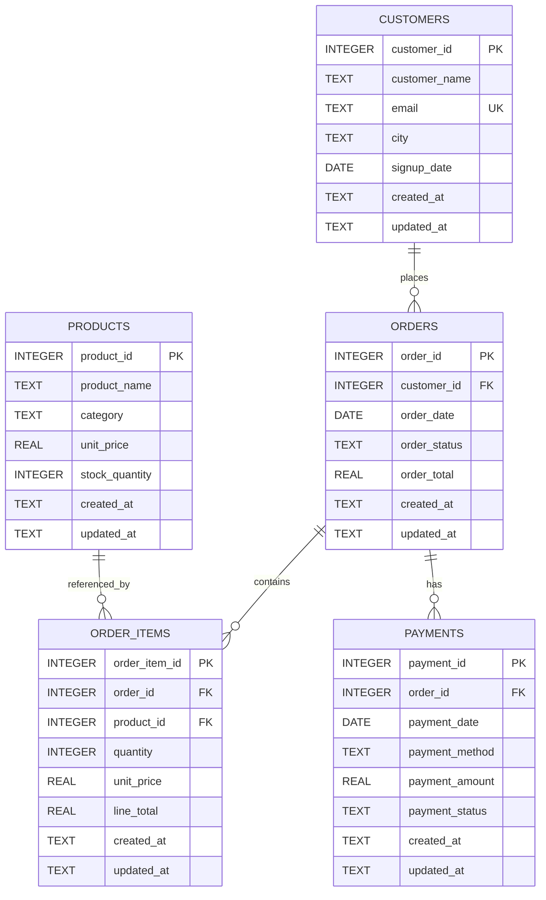
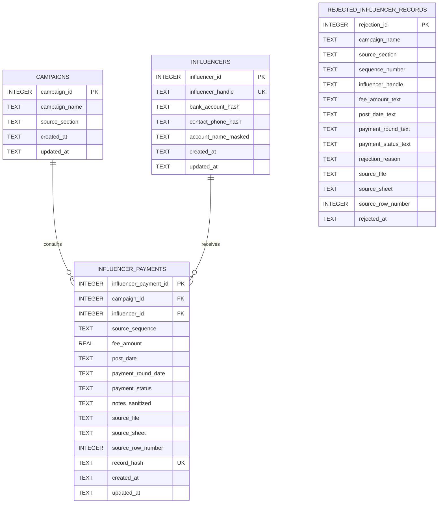
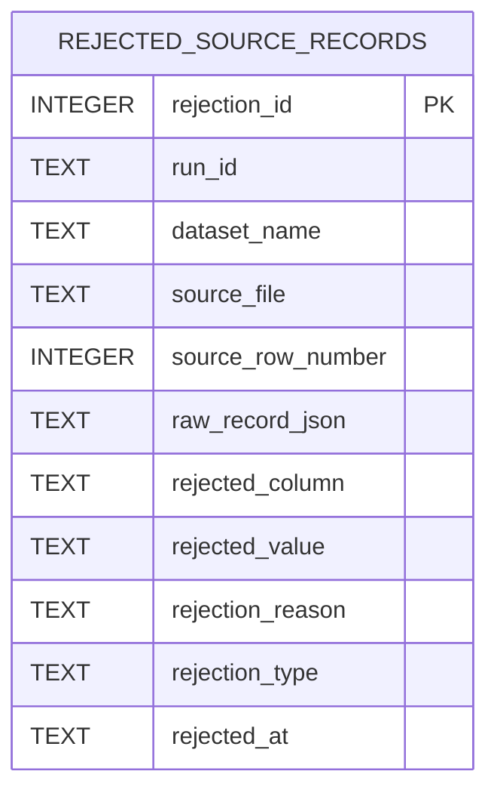
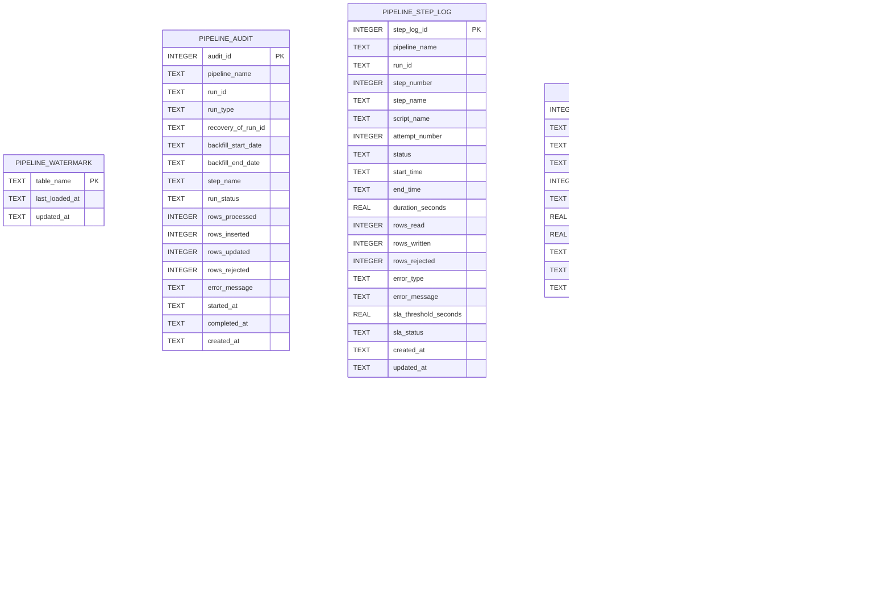
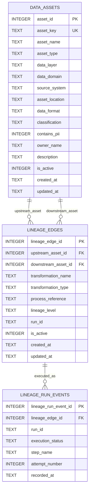
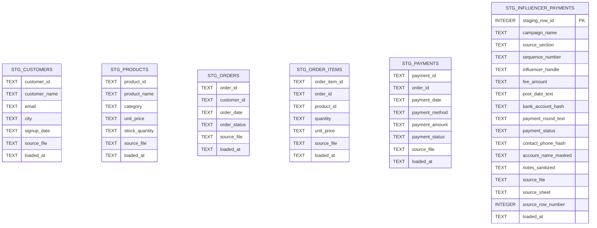

# Project 01 — SQLite Database ER Diagram

This document reflects the current Project 01 SQLite schema after the reliability, monitoring, alerting, recovery, governance, and lineage milestones.

The repository currently defines **25 persistent SQLite tables**:

- **6 staging tables**
- **10 business / quarantine tables**
- **6 pipeline operations / observability tables**
- **3 governance / lineage tables**

To keep the diagrams readable, the schema is split into focused ER views. Only relationships enforced by SQLite foreign keys are drawn as ER relationships. Run IDs and other operational correlation fields are intentionally not shown as foreign-key relationships when the database does not enforce them as such.

---

## 1. E-commerce core model



### Core relationship rules

- `orders.customer_id` → `customers.customer_id`
- `order_items.order_id` → `orders.order_id`
- `order_items.product_id` → `products.product_id`
- `payments.order_id` → `orders.order_id`

---

## 2. Influencer-payment model



`rejected_influencer_records` is intentionally independent from the accepted business tables. Invalid records are preserved as evidence rather than forced into the trusted model.

---

## 3. Generic source quarantine



`rejected_source_records.run_id` is nullable. A value links rejection evidence to a known run, while a null value represents evidence that could not be durably linked to one pipeline run.

---

## 4. Pipeline operations and observability



### Important operational semantics

The pipeline uses `run_id` across audit, step, SLA, rejection, alert, and runtime-lineage evidence to correlate one execution. Most of these links are application-level correlations rather than SQLite foreign keys.

`pipeline_audit.recovery_of_run_id` records the failed top-level run that a declared recovery is intended to recover. It is deliberately shown as a field rather than a physical self-referencing foreign key because the schema does not enforce that relationship.

Alert lifecycle state is constrained to:

```text
OPEN → ACKNOWLEDGED → RESOLVED
```

`pipeline_alert_occurrences.alert_id` is an enforced foreign key to `pipeline_alerts.alert_id` with cascading deletion.

---

## 5. Governance and lineage



### Governance model

`data_assets` is the registry of files, tables, views, outputs, and other governed assets.

`lineage_edges` stores the static dependency graph between registered upstream and downstream assets.

`lineage_run_events` records which lineage edge participated in a concrete pipeline execution.

---

## 6. Staging layer

The six staging tables intentionally keep source-like values as text where appropriate so validation and transformation happen after ingestion.



The staging tables do not enforce business foreign keys. That is intentional: malformed, late, or referentially invalid source records must be ingestible so the pipeline can validate, quarantine, and explain them instead of failing before evidence is captured.

---

## Physical table inventory

| Layer | Tables |
|---|---|
| Staging | `stg_customers`, `stg_products`, `stg_orders`, `stg_order_items`, `stg_payments`, `stg_influencer_payments` |
| E-commerce core | `customers`, `products`, `orders`, `order_items`, `payments` |
| Influencer-payment core | `campaigns`, `influencers`, `influencer_payments` |
| Quarantine | `rejected_influencer_records`, `rejected_source_records` |
| Pipeline operations | `pipeline_watermark`, `pipeline_audit`, `pipeline_step_log`, `pipeline_sla_metrics` |
| Alerting | `pipeline_alerts`, `pipeline_alert_occurrences` |
| Governance / lineage | `data_assets`, `lineage_edges`, `lineage_run_events` |

Views are documented separately from physical tables and therefore are not represented as ER entities here.
