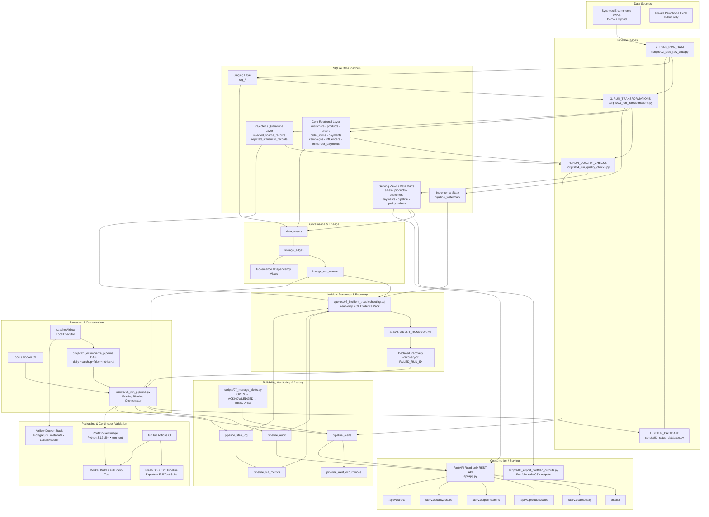

# SQL E-commerce Data Engineering — Pipeline Architecture

This diagram represents the current Project 01 architecture after the reliability, observability, Airflow, REST API, performance, CI/CD, and incident-response milestones.



## Architecture notes

### Airflow wraps the existing orchestrator

Airflow is an orchestration layer, not a second implementation of the pipeline.

The DAG ultimately executes:

```text
python /opt/project/scripts/05_run_pipeline.py
```

This keeps business execution logic inside the existing orchestrator and avoids duplicating ingestion, transformation, quality, retry, audit, and recovery behavior inside the DAG.

### Demo and Hybrid modes share one pipeline

- **Demo Mode** uses only version-controlled synthetic CSV files and is the default public/CI path.
- **Hybrid Mode** adds the private Pawchoice workbook while keeping sensitive source data outside Git and Docker images.

### SQLite remains the Project 01 business data store

Airflow uses PostgreSQL for Airflow metadata, but Project 01 business data continues to use SQLite.

### Serving is read-only

The FastAPI layer reads the SQLite serving layer and exposes read-only endpoints for health, sales, product sales, pipeline runs, quality issues, and alerts.

It does not expose mutating business-data routes.

### Recovery preserves lineage to the failed run

Declared recovery is executed with:

```powershell
python scripts/05_run_pipeline.py --recovery-of <FAILED_RUN_ID>
```

The recovery run records `recovery_of_run_id`, allowing the incident evidence pack to distinguish a true declared recovery from an unrelated later successful run.

### CI validates both host and Docker execution

GitHub Actions validates:

1. dependency installation,
2. Demo Mode configuration,
3. fresh-database reproducibility,
4. end-to-end pipeline execution,
5. portfolio exports,
6. automated tests,
7. artifact collection,
8. Docker image build,
9. the same validation flow inside Docker.
